# Valoria — NeoForge 1.21.1 port

> 🇷🇺 Русская версия документации: [README.ru.md](README.ru.md) · [PORTING.ru.md](PORTING.ru.md) · [CHANGELOG.ru.md](CHANGELOG.ru.md) · [KNOWN_ISSUES.ru.md](KNOWN_ISSUES.ru.md). The English documentation is the authoritative version.

This repository is a **community port of [Valoria](https://github.com/IriDark/Valoria)** (by IriDark and contributors) from Forge 1.20.1 to **NeoForge 1.21.1**.

## Please read before opening an issue

- This port was made **with the permission of the original author**.
- **Do not contact the original author with concerns about this port.** The maintainer of *this* repository is responsible for it. Bugs, crashes, or questions about the NeoForge 1.21.1 build belong in this repository's issue tracker, not in the upstream Valoria repository, its Discord, or its wiki.
- You may use this port on the same terms as the original mod: whatever **licensing and permissions the original Valoria requires still apply here**. The repository ships the original `LICENSE` file unchanged (**code: GNU GPL-3.0; assets: Creative Commons Attribution-NonCommercial 4.0 International**). If you redistribute or build on this port, you must keep complying with those licenses and with any conditions the original author has set.

## Download

Jars are published only on this repository's [Releases page](https://github.com/BelialRunnerX/Valoria-NeoForge/releases) (current: `v1.21.1-1.0.4.2`, marked pre-release). You also need the [Tridot port release](https://github.com/BelialRunnerX/Tridot-NeoForge/releases), Curios and GeckoLib (versions below). The port is not on CurseForge or Modrinth.

## Status

- **Working build, not fully validated.** The client starts, creates and loads worlds; a dedicated server boots with a clean log. Verified by hand so far (2026-09-24): the Codex, curios and the nihility meter, the Valoria dimension, summoning the four bosses (boss bars, music, Firron cutscene), the crafting-station GUIs, stone crusher, weapon abilities and the Phantasm Bow, structure placement via `/locate`, JEI/Jade. An automated in-game harness (`tools/porttest`) additionally verified portal travel both ways, kiln recipe execution, enchantment availability, Curios attribute bonuses, nihility damage, four boss fights with loot, entity spawning and the crypt codex unlock. What remains untested is listed in [KNOWN_ISSUES.md](KNOWN_ISSUES.md). Treat the builds as beta and expect bugs in untested areas.
- `./gradlew build` produces `Valoria-1.21.1-1.0.4.2.jar`; the data generator boots the complete mod set (NeoForge, Tridot, Curios, GeckoLib, JEI, Jade, JER, KubeJS, Dummmmmmy).
- **[CHANGELOG.md](CHANGELOG.md)** lists every port fix by commit, **[KNOWN_ISSUES.md](KNOWN_ISSUES.md)** lists open, upstream-inherited and not-yet-verified items, and [PORTING.md](PORTING.md) documents each rewrite. Please check the known-issues list before reporting.

## What changed

Every non-trivial rewrite (registration, events, networking, item NBT → data components, capabilities → attachments, enchantments → data, portal, rendering, mixins, the data pack) is documented in [PORTING.md](PORTING.md), and each code site carries a `// PORT NOTE:` comment explaining the change. The mod was ported in full — no feature was stubbed out or removed.

## Requirements and tested versions

The port is built and tested against these exact versions. Newer patch releases will usually work, but these are the ones known to.

| Component | Version | Where to get it |
|---|---|---|
| Minecraft | 1.21.1 | — |
| Java | 21 (Temurin 21.0.12 used) | https://adoptium.net/ |
| **NeoForge** | **21.1.251** (accepted range `[21.1,)`) | https://neoforged.net/ · https://projects.neoforged.net/neoforged/neoforge |
| **Tridot (NeoForge port)** | **1.21.1-1.0.169** (range `[1.21.1-1.0.169,)`) | https://github.com/BelialRunnerX/Tridot-NeoForge — required; the Forge 1.20.1 Tridot from CurseForge/Modrinth will **not** work |
| **Curios API** | **9.5.1+1.21.1** (range `[9,)`) | https://modrinth.com/mod/curios · https://www.curseforge.com/minecraft/mc-mods/curios |
| **GeckoLib** | **4.9.3** for NeoForge 1.21.1 (range `[4.7,)`) | https://modrinth.com/mod/geckolib · https://www.curseforge.com/minecraft/mc-mods/geckolib |

Optional integrations, compiled and tested against:

| Mod | Version | Link |
|---|---|---|
| JEI | 19.57.0.447 | https://modrinth.com/mod/jei |
| Jade | 15.10.6+neoforge | https://modrinth.com/mod/jade |
| Just Enough Resources (JER) | 1.6.0.17 (NeoForge build) | https://modrinth.com/mod/just-enough-resources-jer |
| KubeJS / Rhino / Architectury | 2101.7.2-build.377 / 2101.2.8-build.91 / 13.0.11 | https://modrinth.com/mod/kubejs |
| Dummmmmmy + Moonlight Lib | 1.21-2.1.2 (NeoForge) + 1.21.1-3.6.8 (NeoForge) | https://modrinth.com/mod/mmmmmmmmmmmm · https://modrinth.com/mod/moonlight |
| Better Combat, Obscure Tooltips, JEED, Enchantment Descriptions, Catalogue | any 1.21.1 build (data/lang only) | — |
| Tetra | no 1.21 release yet — integration inert | — |

Things players and pack makers need to know:

- **Dependencies:** see the table above. Install the NeoForge builds of Curios and GeckoLib, not the Forge or Fabric ones.
- **Integrations:** JEI, Jade, JER, KubeJS, JEED, Enchantment Descriptions, Better Combat, Catalogue and Obscure Tooltips are ported. The Tetra material data is still shipped but inert until Tetra releases for 1.21.
- **Worlds from 1.20.1:** item NBT is migrated by vanilla into `minecraft:custom_data` and read back from there; player data (codex pages, nihility, magma charge, abilities) keeps its ids. Blocks/items that were *renamed* before 1.0.4 are no longer remapped (NeoForge has no `MissingMappingsEvent`). Back up worlds first.
- **Enchantments** (Bleeding, Accuracy, Explosive Flame) are data-driven JSON; Valoria's tools and armour use the `minecraft:enchantable/*` tags.
- **Data packs / KubeJS:** folders follow 1.21 naming (`recipe`, `loot_table`, `tags/item`...), conventional tags use the `c:` namespace, and the KubeJS recipe schemas keep the same script keys as 1.20.1.
- **Config files** are unchanged: `valoria/client.toml`, `valoria/common.toml`, `valoria/server.toml`.

## For developers

Requirements: Java 21, NeoForge 21.1.x, Minecraft 1.21.1.

The Tridot port is not on a public Maven yet, so build it first:

```bash
git clone https://github.com/BelialRunnerX/Tridot-NeoForge
cd Tridot-NeoForge && ./gradlew publishToMavenLocal
```

Then in this repository:

```bash
./gradlew build        # jar in build/libs
./gradlew runClient    # dev client
./gradlew runData      # regenerate src/generated/resources
```

---

# ABOUT THIS MOD
**An ancient cataclysm—the Elemental Collapse—tore reality asunder. From the ashes, a new world was born: a realm of dark myth and terrifying ruin.**

*Valoria* transforms Minecraft into an epic, dark-fantasy RPG experience. Journey through desolate landscapes haunted by monstrous creatures, piece together the fractured history of a fallen world, and discover if hope can be rekindled from the embers.
### Features
* **⚔️ Epic Encounters:** Face new mobs and terrifying bosses using a huge arsenal of weaponry. Includes loads of new building blocks and items, all maintaining a vanilla-friendly aesthetic.
* **🏰 Uncharted Lands:** Explore intricate structures, bizarre biomes, and a completely new Dimension fraught with secrets and danger.
* **📖 Deep Lore:** Uncover a rich, dark-fantasy storyline rooted in mythology and designed to reward exploration.
* **🎵 Immersive Audio:** Experience a haunting Original Soundtrack composed by [DuUaader](https://youtube.com/playlist?list=OLAK5uy_kTIzlCKrHm_RyFxoZPmnKZNccdCT6XL-c&si=0-No5jkq0tsd3neC).
* **🔧 Highly Configurable:** Modpack developers have full control. Move or hide HUD elements (`valoria/client.toml`), customize boss stats (`valoria/common.toml`), or toggle core mechanics like Nihility, Food Rot, and Codex progression (`valoria/server.toml`).

---

### 🏛️ UNEARTH FORGOTTEN RUINS
Valoria's landscape is scattered with unique, hand-crafted structures waiting to be discovered. From crumbling ruins to massive containment facilities hiding specific entities—tread carefully, for deadly traps and ancient guardians still protect what lies within.

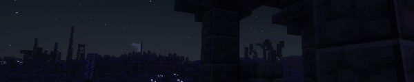
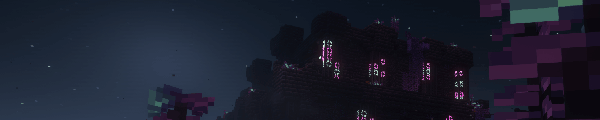
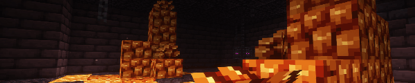

### 🌿 SURVIVE THE TWISTED FLORA
The Collapse didn’t destroy the world; it mutated it. Journey through vibrant, alien biomes where nature struggles to reclaim the ruins. The old flora has given way to strange new life forms that produce their own light. In this eternal twilight, luminescent plants may be your only beacon of hope.

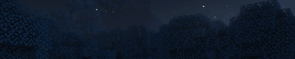
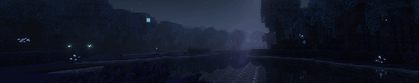
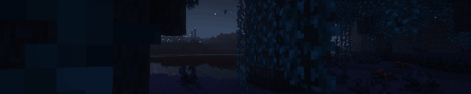
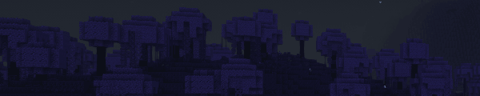

### 💀 SCAVENGE THE ASHEN BARRENS
Traverse the open graves of entire ecosystems. Haunted by skeletal forests and choked with dust, the Barrens are a scarred landscape slowly being eroded by a relentless, sorrowful wind.

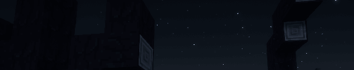

### 🐺 FACE TERRIFYING ABERRATIONS
The fauna of the old world was not spared. Corruption forced creatures to adapt or perish, turning the survivors into fiercely territorial hunters. They stalk the shadows of this broken world, and to them—you are nothing but prey.

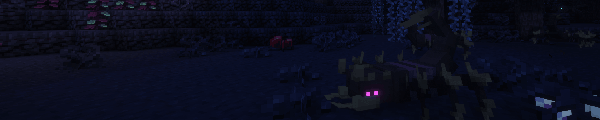
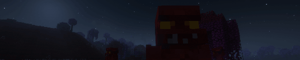

### 🩸 UNRAVEL THE CELESTIAL PLAGUE
The sky itself is shattered. A malevolent red planet now hangs in the night, its very gaze acting as a poison upon the land. This celestial body fuels a creeping "bloodborne corruption"—a plague that continues to consume the world. Follow its trail and you will discover colossal, infected remains known only as the 'Monstrosities'.

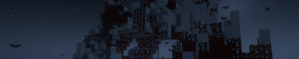
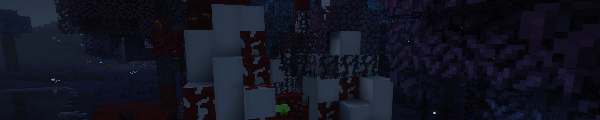
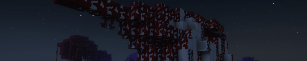

---

### 🛠️ INTEGRATIONS & COMPATIBILITIES

* **Built-in Support (ported):** JADE, JER, JEI, KubeJS, JEED, Enchantment Descriptions, Better Combat, Catalogue, Obscure Tooltips.
* **Shipped but inert on 1.21.1:** Tetra (no 1.21 release yet).
* **Upstream-only (1.20.1):** the Epic Fight and Dynamic Trees add-ons target the Forge 1.20.1 version and have not been ported here.

---

### 🌐 SUPPORTED LANGUAGES

*  **English**
*  **Ukrainian** - by IriDark, Foxplane
*  **Polish** *(WIP)* - by 𝙆𝘼𝙈𝙀𝙃𝙇𝙇𝙄𝙉𝙆
*  **Russian** - by Ruthenium, TerraPrime, Kerdo
*  **French** *(WIP)* - by 𝙆𝘼𝙈𝙀𝙃𝙇𝙇𝙄𝙉𝙆
*  **Chinese** - by 蓝龙奈特萨玛 (Azurmardraco BlueDragon)

*Translation fixes for the port are welcome as pull requests here (see [CONTRIBUTING.md](CONTRIBUTING.md)); new languages belong upstream so both versions benefit.*

---

### 📜 CREDITS & CONTRIBUTORS

All credit for Valoria itself goes to its authors — **IriDark, Sunday, Kerdo, DuUaader** and the contributors below. The NeoForge 1.21.1 port is maintained separately by [BelialRunnerX](https://github.com/BelialRunnerX).

* **AstemirDev** - Code
* **Auriny** - Code, Testing
* **Skoow** - Code
* **Sunday** - Models
* **Kerdo** - Animations, SFX, Ideas, Contributions
* **LowTransient-34** - Music

**Translators:** Ruthenium, TerraPrime, 𝙆𝘼𝙈𝙀𝙃𝙇𝙇𝙄𝙉𝙆, 蓝龙奈特萨玛 (Azurmardraco BlueDragon)

**Special Thanks & Assets:**
* *Pandafolk_Ravio_Li, Rofoo, KoteykaTheCat, GraFik, Wosaj, Rainach, .sweetberries, Feimos, Avacuoss*
* **Calamity Mod Team** - For amazing sound design inspiration and sound assets.
* **Tyro.net** - Space background in Codex ([Source](https://tools.wwwtyro.net/space-3d/index.html))

---

Original project: https://github.com/IriDark/Valoria — wiki, Discord and Patreon links for the *original* mod are on that page.
